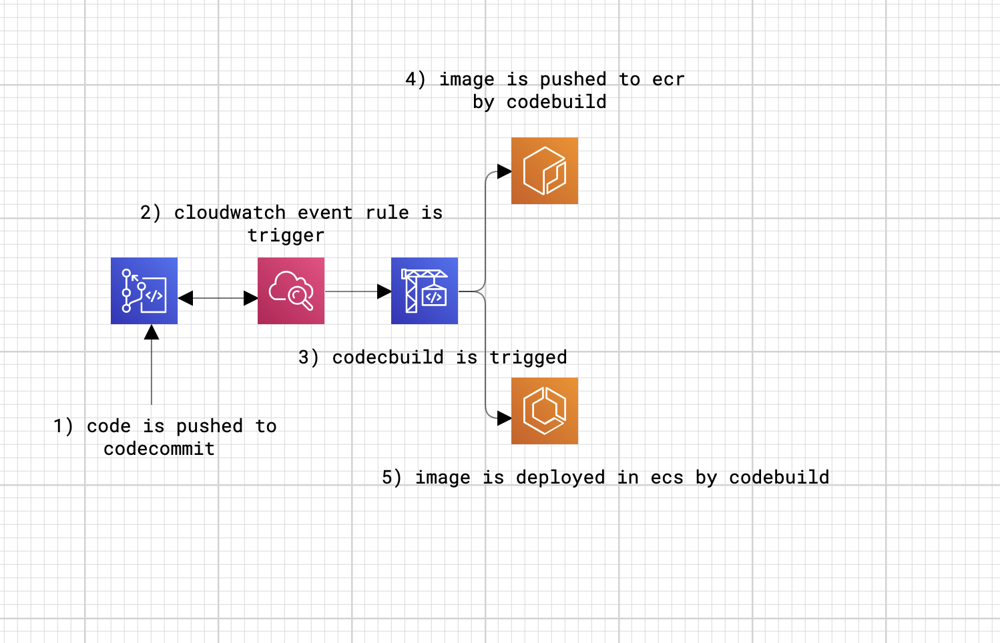
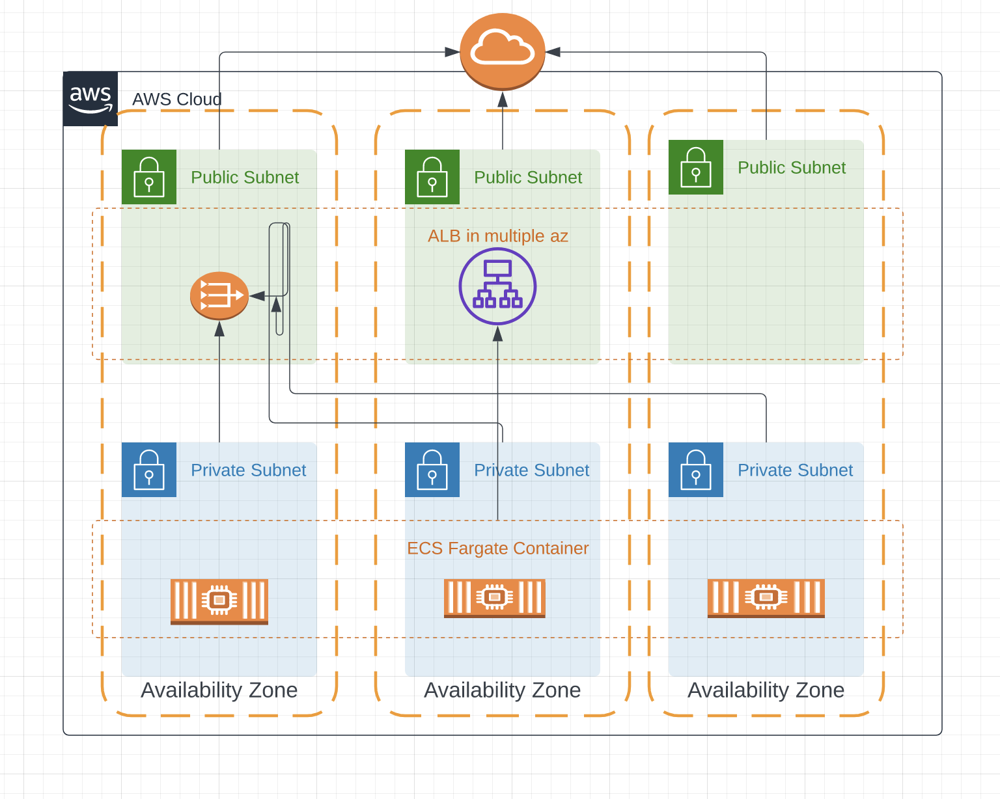

## Table of Content
- Dockerise wordpress app
- CI/CD pipeline using terraform in AWS
- Infrastructure creation for ecs fargate

### Dockerise wordpress app
```
- Use php-apache as base image
- Install dependencies and set workdir
- Copy wordpress application code and set permissions
- Start apache in foreground inside container as pid(1) process
```

### CI/CD pipeline using terraform in AWS
```
Modules created to create pipeline are as follows
- Codecommit
- Codebuild
- Clouwatch-Events
```
## Basic CI/CD flow



### Infrastructure creation for ecs fargate

```
Modules to create infra are as follows
- networking
- efs
- ecr
- rds
- secret-manager
- loadbalancer
- ecs
```

## Network Diagram

